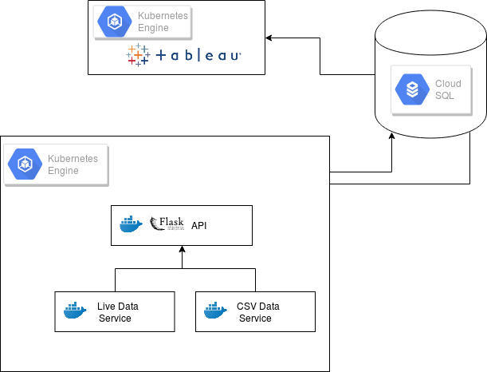
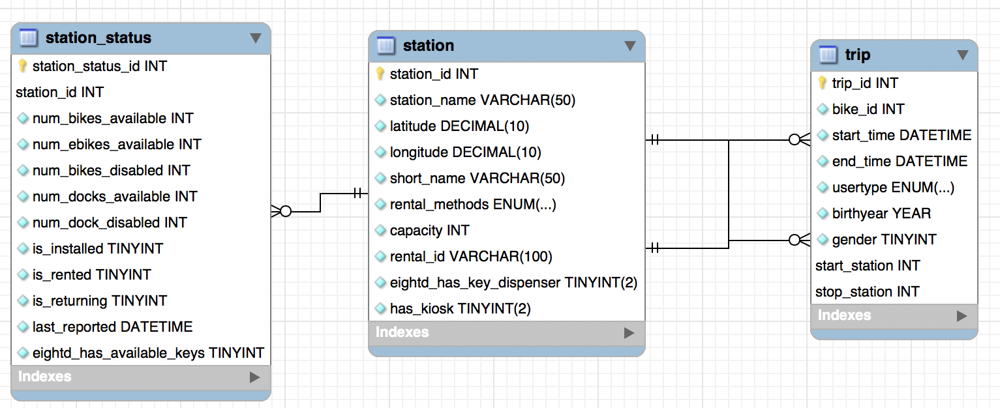
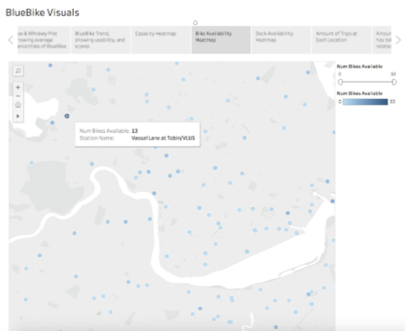

# bluebikedata

### Background

> Our goal is to develop insights on existing BlueBike trip data and create an application to aid in analyzing and providing feedback from live feed data from BlueBike stations. We seek to analyze trip data, station status data, and station location data, in order to create a comprehensive understanding of BlueBike usage.

<!-- We are live! - Check out:
	* our Front-End at: http://35.245.104.115:8080/ -->

We're not live atm (we deployed to GCP but were running out of credit RIP) but you can run it locally.

This project provides a bare-bones application, not connected to any MySQL database. Provided that you have your own database you'd like to aggregate data in, we give you the means to define a database (see our schema in the `docs` directory), an API to access that database, services that use the API to insert data in the database, and finally a front end service with an interactive module for data visualization.

### Project Architecture

#### Outline
- The Backend:
	- An API Service:
		- A container running the API of our application. Abstracts away connecting to DB and sending queries via the following API calls:
			- GET Request Path: `/<entity>`
			- POST Request Path: `/<entity>`
		- See the `docs/api` folder for more information
	- An Auth Service:
		- A container that gives DB credentials to the API service.
		- Based on what type of user is calling the API, will provision a different DB connection
			- If we are calling it from front-end server, then we assume the unauthenticated, default role ""
			- If we are calling it via our data service, then we assume the authenticate role "data-creator"
	- A Live Data Service :
		- A container that calls the API to upload live data from GBFS to our DB
			- Will always be running, polling https://gbfs.bluebikes.com/gbfs/gbfs.json for data, and adding that to DB
			- Will also have an additional method to upload data from CSV files
	- A CSV Data Service :
		- A container that calls the API to upload csv data provided by users to our DB
			- Will always be running, polling https://gbfs.bluebikes.com/gbfs/gbfs.json for data, and adding that to DB
			- Will also have an additional method to upload data from CSV files

- The Frontend:
	- An Nginx Service:
		- Host HTML, CSS with and embedded Tableau module

#### Architecture Diagram

#### Database ER Diagram

### Visualizations

Since we're not currently up, here are some fun visuals that show what kind of questions we can answer with the data we've aggregated from Bluebike.

#### Bike Availability Heatmap

A map of Boston, with Bluebike of stations represented as dots. The darker the dot, the more bikes the station has at the moment.

#### Daily Average Bike vs. Dock Availability

Plots the average bike availability and the average dock availability for the given station(s) at different hours during the day.

### Installation and Running Locally

1. Install MySQL Server on your device, or create one on Google Cloud Platform's Cloud SQL.
	- Recommended: Create two users (beyond just the root connection): 
		- one with only read permission (`SELECT`)
		- the other with both read and write perm (`SELECT` and `INSERT`)
2. Install Python 3.x: https://www.python.org/downloads/
3. Install `pip`: https://pip.pypa.io/en/stable/installing/
4. Install Docker Community Edition : https://docs.docker.com/install/
5. Clone this repo: Run `git clone https://github.com/raghavp96/bluebikedata.git` on your terminal
6. Use the script in the docs folder to create the database in your MySQL server (with a root connection)
7. Install the Python `docker` package: Run `pip install docker` on your terminal (make sure your `pip` is for Python3)
8. Go to the `auth` folder and rename each `template-*.json` file to `role-*.json` - place the appropriate information in each JSON
9. In your terminal, ensure you are in the root directory of the project (where this README is). Run `make start`
10. In your browser, visit:
	- http://localhost:8001/, and
	- http://localhost:8001/station

	where you should see jsons displayed on the page
11. Run `make stop` to stop all containers

### Deployment

All of the files in `gcp/` are irrelevant for the purposes of running locally. They are usedpurely for deployment.

The Deployment Process:

1. We build and push the Docker images for all our services into a precreated Project on Google Container Registry.

2. Our API service, Auth service, and Data services are then bundled into one Kubernetes Deployment, which we've exposed as a Kubernetes Service. 
	
	-  We did this to allow each container to be on the same host network, to mirror our local Docker intercontainer communication configuration )

	<!-- - Our API is up (kind of) at: http://35.186.161.84:8001/ -->

3. Our Front End Service is then bundled into its own Kubernetes Deployment, which we've exposed as a separate Kubernetes Service.

	- For security reasons we whitelist the IP's of machines with access to our CloudSQL Instance

#### Other Topics

1. Roles - We mention that different services/components will be hitting the API, and that they will assume different roles. This allows us to better tighten the security on what calls a user can make to our API. The roles are:
	- Default - The front end will assume the `default` role, allowing it to make only GET requests
	- Data Creator - The data service will need to be able to query and mutate the DB, and so assumes the `data-creator` role. It will be able to make both GET and POST
2. Containers - We use containers here, adopting a microservice architecture. This allows for true process isolation, and allows us to increase security.
3. `container_manager.py` and `config.json` - Cloned from https://github.com/raghavp96/dockernetes, these enable us to run services in their own container, attach them all to the same Docker network, so they can still communicate. Config.json allows us to specify what ports the services are running on.
	- Ex: The API service needs to get DB credentials from the Auth service.